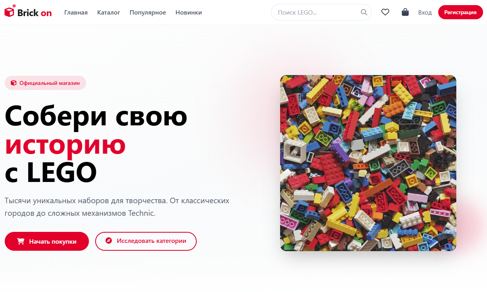
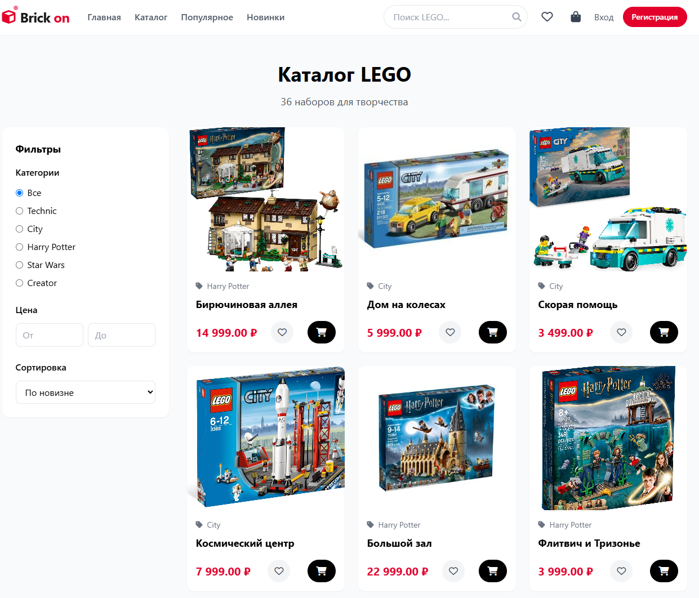
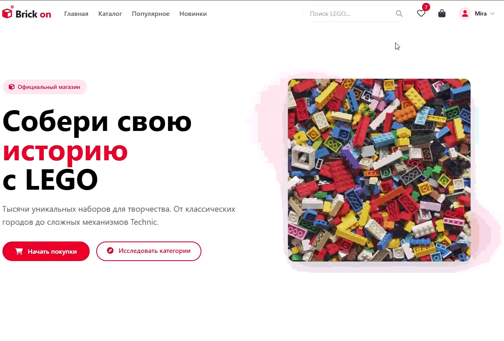
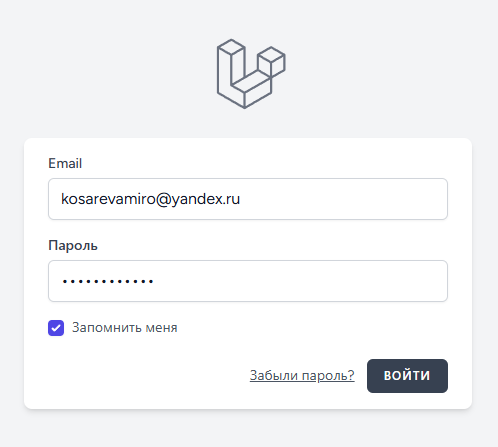
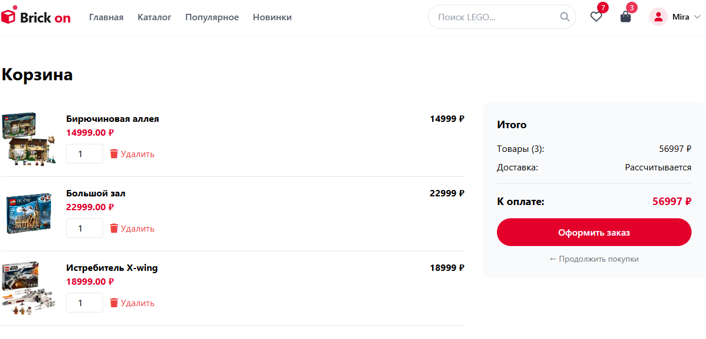
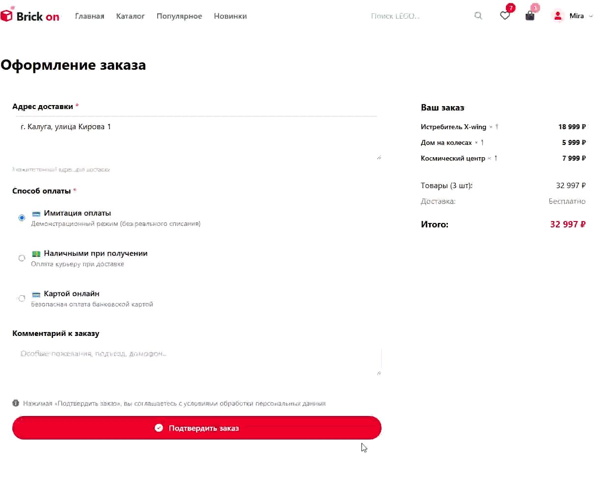
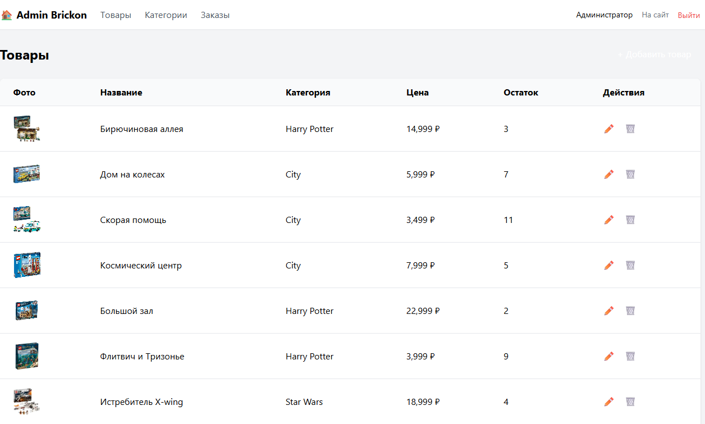
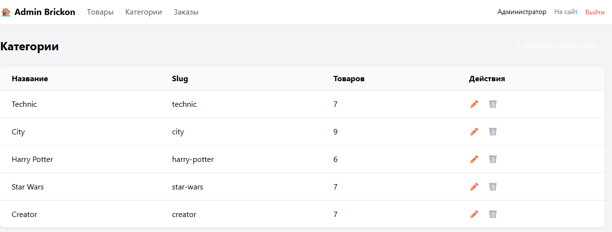

# Brickon — интернет-магазин LEGO конструкторов

Интернет-магазин на Laravel с полным функционалом: каталог, корзина, избранное, админ-панель, имитация оплаты.

## Демонстрация работы

### Главная страница

<div align="center">
  
  <p><em>Главная страница с категориями и поиском</em></p>
</div>

<br>

### Каталог товаров

<div align="center">
  
  <p><em>Каталог с фильтрацией по категориям, цене и сортировкой</em></p>
</div>

<br>

### Поиск и карточка товара

<div align="center">
  
  <p><em>Поиск по названию и открытие карточки товара</em></p>
</div>

<br>

### Регистрация и авторизация

<div align="center">
  
  <p><em>Вход в личный кабинет</em></p>
</div>

<br>

### Избранное

<div align="center">
  
  <p><em>Список избранных товаров</em></p>
</div>

<br>

### Корзина

<div align="center">
  
  <p><em>Корзина с возможностью изменения количества и удаления товаров</em></p>
</div>

<br>

### Оформление заказа и оплата

<div align="center">
  
  <p><em>Оформление заказа с выбором способа оплаты (имитация)</em></p>
</div>

<br>

### Админ-панель

<div align="center">
  
  <p><em>Управление товарами в админ-панели</em></p>
</div>

<br>

<div align="center">
  
  <p><em>Управление категориями товаров</em></p>
</div>

<br>

<div align="center">
  
  <p><em>Управление заказами и изменение статусов</em></p>
</div>

## Технологии

- **Backend**: Laravel 13.2.0, PHP 8.3.30
- **Frontend**: Tailwind CSS
- **База данных**: MySQL
- **Аутентификация**: Laravel Breeze
- **Админ-панель**: Кастомная

## Возможности

- Регистрация и авторизация пользователей
- Каталог товаров с фильтрацией по категориям и цене
- Поиск товаров
- Добавление в избранное
- Корзина с изменением количества товаров
- Оформление заказа с вводом адреса
- Имитация оплаты (демо-режим)
- Админ-панель для управления товарами, категориями и заказами

## Установка и запуск

```bash
# Клонирование репозитория
git clone https://github.com/MiraKosareva/Brickon.git
cd brickon

# Установка зависимостей
composer install
npm install

# Настройка окружения
cp .env.example .env
php artisan key:generate

# База данных (создайте БД в phpMyAdmin и укажите в .env)
php artisan migrate --seed

# Создание ссылки для хранения изображений
php artisan storage:link

# Запуск (в двух терминалах)
npm run dev
php artisan serve
```

## Доступ к админ-панели
1. Зарегистрируйтесь на сайте (перейдите по адресу /register)
2. После регистрации откройте терминал в папке проекта и выполните:

```bash
php artisan tinker
>>> $user = User::find(1);
>>> $user->is_admin = true;
>>> $user->save();
>>> exit
```
3. Теперь перейдите на /admin — вам доступно управление товарами, категориями и заказами

## Лицензия 
MIT License

Copyright (c) 2026 Mira Kosareva

Permission is hereby granted, free of charge, to any person obtaining a copy
of this software and associated documentation files (the "Software"), to deal
in the Software without restriction, including without limitation the rights
to use, copy, modify, merge, publish, distribute, sublicense, and/or sell
copies of the Software, and to permit persons to whom the Software is
furnished to do so, subject to the following conditions:

The above copyright notice and this permission notice shall be included in all
copies or substantial portions of the Software.

THE SOFTWARE IS PROVIDED "AS IS", WITHOUT WARRANTY OF ANY KIND, EXPRESS OR
IMPLIED, INCLUDING BUT NOT LIMITED TO THE WARRANTIES OF MERCHANTABILITY,
FITNESS FOR A PARTICULAR PURPOSE AND NONINFRINGEMENT. IN NO EVENT SHALL THE
AUTHORS OR COPYRIGHT HOLDERS BE LIABLE FOR ANY CLAIM, DAMAGES OR OTHER
LIABILITY, WHETHER IN AN ACTION OF CONTRACT, TORT OR OTHERWISE, ARISING FROM,
OUT OF OR IN CONNECTION WITH THE SOFTWARE OR THE USE OR OTHER DEALINGS IN THE
SOFTWARE.
